# IPMS System Architecture

Installer Program Management System — Fronus Solar Energy

Complete system architecture diagram for the IPMS Next.js application (App Router, React Server Components, MongoDB, Vercel deployment).

---

## Table of Contents

1. [System Overview](#system-overview)
2. [Layer 1 — Client](#layer-1--client)
3. [Layer 2 — Rendering & Framework](#layer-2--rendering--framework)
4. [Layer 3 — Data Access & Caching](#layer-3--data-access--caching)
5. [Layer 4 — External Services & Database](#layer-4--external-services--database)
6. [Layer 5 — Infrastructure & CI/CD](#layer-5--infrastructure--cicd)
7. [Request Lifecycle](#request-lifecycle)
8. [Authentication Flow](#authentication-flow)
9. [Installer Registration Flow](#installer-registration-flow)
10. [Caching Strategy](#caching-strategy)
11. [Rendering Modes](#rendering-modes)

---

## System Overview

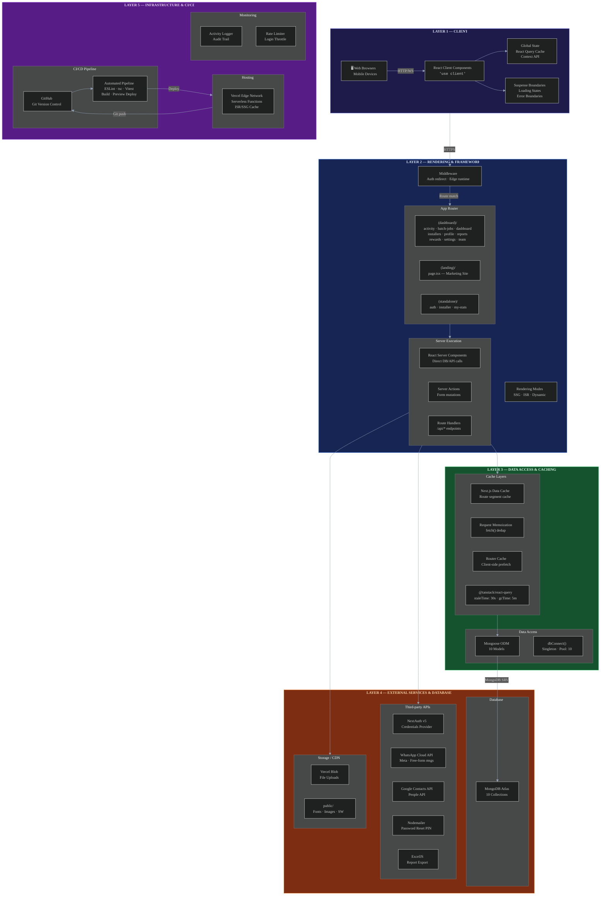

---

## Layer 1 — Client

```mermaid
%%{init: {'theme': 'dark', 'themeVariables': {
  'primaryColor': '#6366f1',
  'primaryTextColor': '#f8fafc',
  'lineColor': '#94a3b8',
  'fontSize': '13px'
}}}%%

graph LR
    subgraph BROWSER["Browser / Mobile"]
        USER["👤 User"]
        SERVICE_WORKER["Service Worker<br/><code>/sw.js</code>"]
        CACHE_API["Cache API<br/>Offline Support"]
    end

    subgraph CLIENT_COMPONENTS["Client Components ('use client')"]
        direction TB
        PROVIDERS["providers.tsx<br/>SessionProvider<br/>QueryClientProvider<br/>Toaster"]
        THEME["ThemeProvider<br/>Dark/Light/System"]
        BATCH_CONTEXT["BatchJobProvider<br/>SSE/Polling"]
        BREADCRUMB["BreadcrumbContext"]

        FORMS["Form Components<br/>react-hook-form + zod"]
        TABLES["Data Tables<br/>@tanstack/react-virtual"]
        MODALS["Dialogs / Drawers<br/>Radix UI"]
        CHARTS["Charts<br/>Recharts"]
    end

    subgraph STATE_MANAGEMENT["State & Caching"]
        direction TB
        REACT_QUERY["React Query Client<br/>• staleTime: 30s<br/>• gcTime: 5m<br/>• refetchOnWindowFocus: false<br/>• retry: 1"]
        CONTEXT_STATE["React Context<br/>BatchJobContext<br/>BreadcrumbContext"]
        URL_STATE["URL State<br/>Search params<br/>Route segments"]
    end

    subgraph UI_BOUNDARIES["UI Boundaries"]
        direction TB
        SUSPENSE["Suspense<br/>Streaming SSR"]
        LOADING["loading.tsx<br/>Route-level loading"]
        ERROR_BOUNDARY["error.tsx<br/>Route-level errors"]
        GLOBAL_ERROR["global-error.tsx<br/>Root-level errors"]
        NOT_FOUND["not-found.tsx<br/>404 page"]
    end

    USER -->|"Interaction"| CLIENT_COMPONENTS
    SERVICE_WORKER --> CACHE_API
    CLIENT_COMPONENTS --> STATE_MANAGEMENT
    CLIENT_COMPONENTS --> UI_BOUNDARIES

    style BROWSER fill:#1e1b4b,stroke:#6366f1,color:#e0e7ff
    style CLIENT_COMPONENTS fill:#1e3a5f,stroke:#38bdf8,color:#e0f2fe
    style STATE_MANAGEMENT fill:#14532d,stroke:#22c55e,color:#dcfce7
    style UI_BOUNDARIES fill:#713f12,stroke:#eab308,color:#fef9c3
```

### Client Component Inventory

| Component | Location | Purpose |
|---|---|---|
| `providers.tsx` | `app/providers.tsx` | Wraps SessionProvider, QueryClientProvider, Toaster |
| `BatchJobProvider` | `contexts/BatchJobContext.tsx` | SSE/polling for bulk operation progress |
| `OfflineIndicator` | `components/OfflineIndicator.tsx` | Network status detection |
| `BatchJobProgress` | `components/BatchJobProgress.tsx` | Real-time progress UI |
| Forms | `components/registration/*` | Installer registration with validation |
| Tables | `components/installers/*` | Virtualized data tables |
| Charts | `components/*` | Dashboard analytics (Recharts) |

---

## Layer 2 — Rendering & Framework

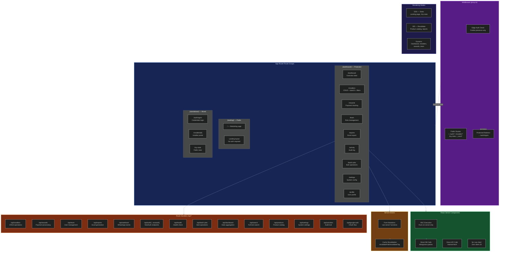

### Middleware Logic (proxy.ts)

```
Request
  → Is public path? (/, /auth/*, /installer/*, /my-stats, /_next/*)
    → YES: NextResponse.next()
    → NO: Check for authjs.session-token cookie
      → Token exists: NextResponse.next()
      → No token: Redirect to /auth/signin?callbackUrl={path}

Note: Edge runtime cannot decode JWT (no DB access).
Full auth + role checks happen in API routes via withAuth HOF.
```

---

## Layer 3 — Data Access & Caching

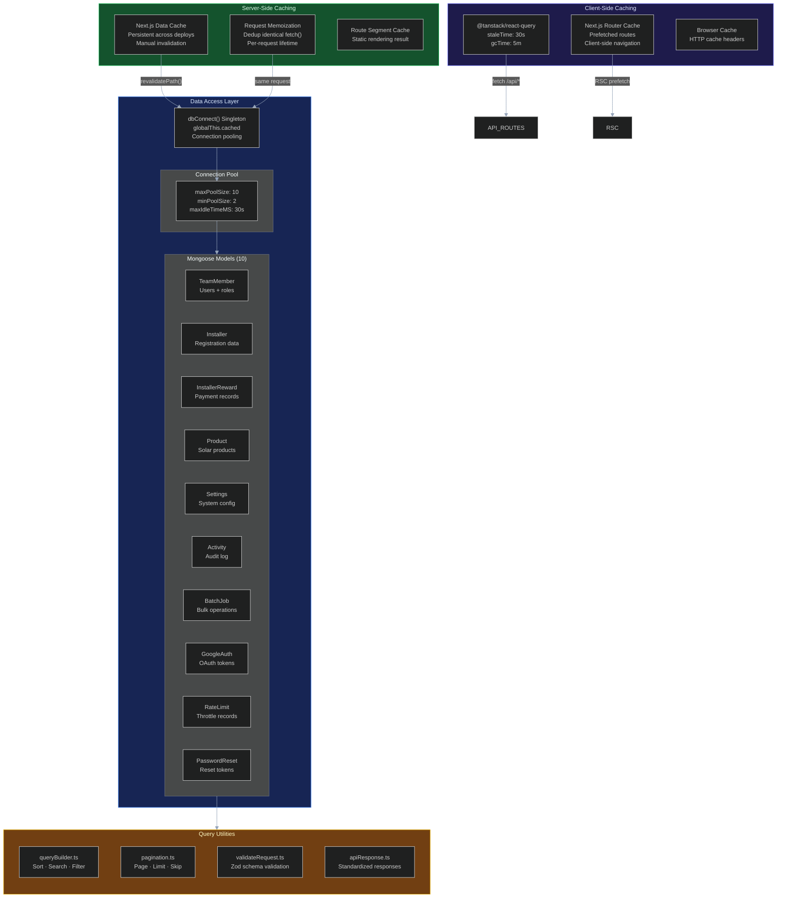

### Cache Hierarchy

```
Request arrives at Next.js server
  │
  ├─ 1. Router Cache (client)    → cached? → return HTML
  │
  ├─ 2. Data Cache (server)      → cached? → return cached response
  │
  ├─ 3. Request Memoization      → same fetch in this request? → dedup
  │
  ├─ 4. Full cache miss
  │     └─ Execute RSC / Route Handler
  │           └─ dbConnect() → Mongoose → MongoDB Atlas
  │
  └─ Store result in Data Cache + return to client
```

---

## Layer 4 — External Services & Database

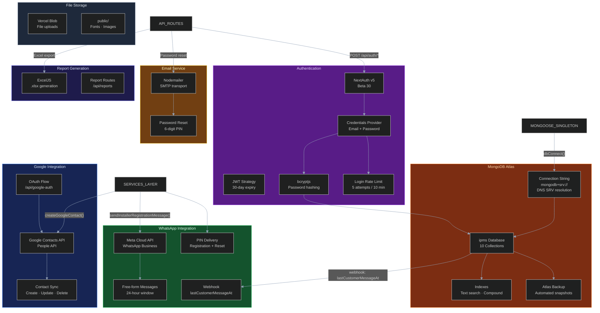

### MongoDB Collections

| Model | Collection | Key Fields |
|---|---|---|
| `TeamMember` | team_members | email, password, role, name |
| `Installer` | installers | installerCode, pin, fullName, whatsappNumber |
| `InstallerReward` | installer_rewards | installer, amount, serialNumber |
| `Product` | products | name, category, isActive |
| `Settings` | settings | enableWhatsAppNotifications, maxReferrals |
| `Activity` | activities | type, performedBy, targetType, changes |
| `BatchJob` | batch_jobs | status, progress, results |
| `GoogleAuth` | google_auths | accessToken, refreshToken, expiry |
| `RateLimit` | rate_limits | key, attempts, windowStart |
| `PasswordReset` | password_resets | email, pin, expiresAt |

---

## Layer 5 — Infrastructure & CI/CD

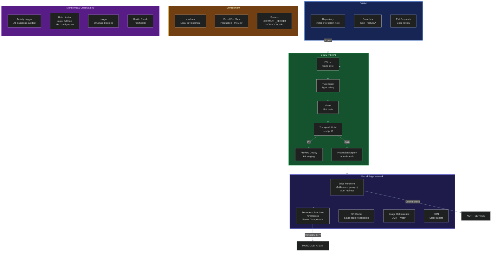

### Build Commands

| Command | Purpose |
|---|---|
| `npm run dev` | Development server (Turbopack) |
| `npm run build` | Production build |
| `npm run build:turbo` | Production build with Turbopack |
| `npm run start` | Start production server |
| `npm run lint` | ESLint check |
| `npm run test` | Vitest unit tests |
| `npm run test:db` | MongoDB connection diagnostic |

---

## Request Lifecycle

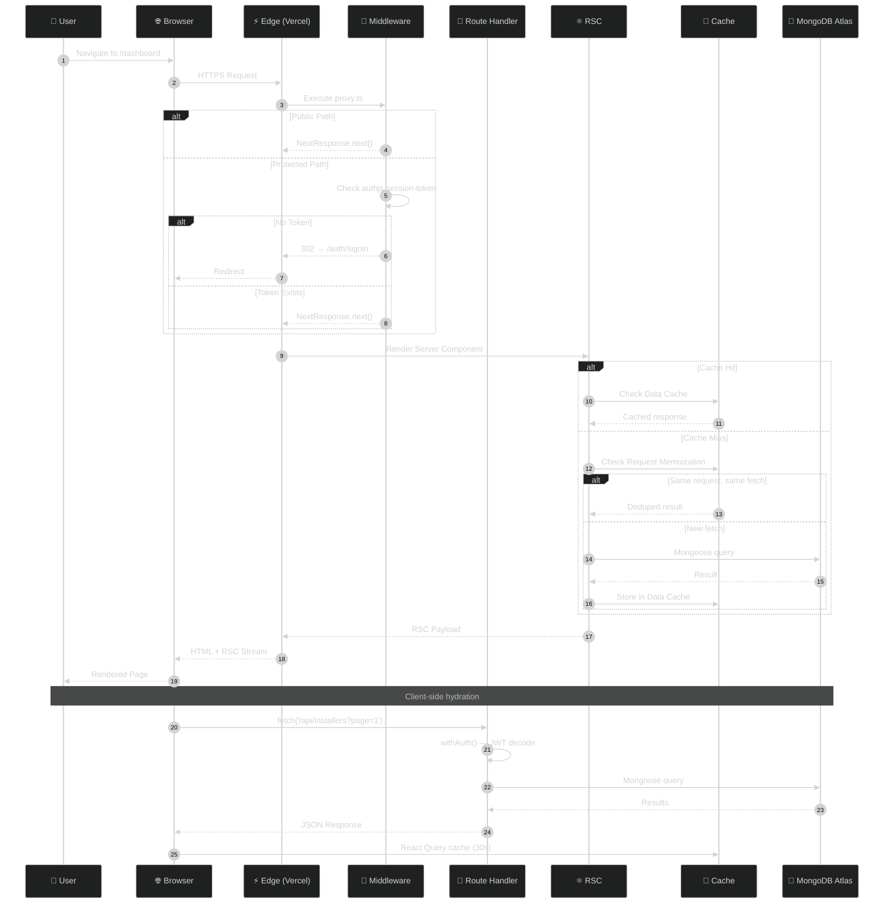

---

## Authentication Flow

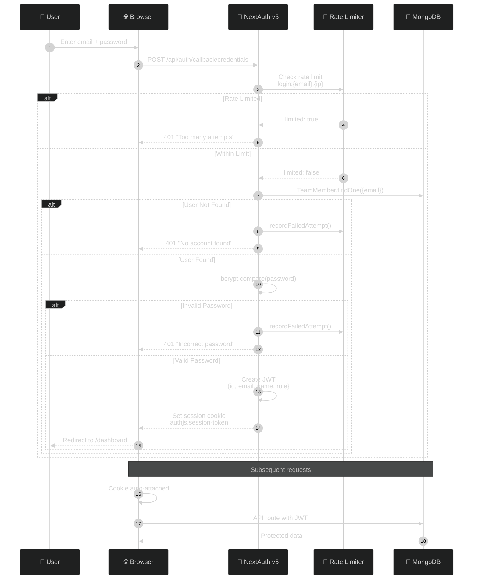

---

## Installer Registration Flow

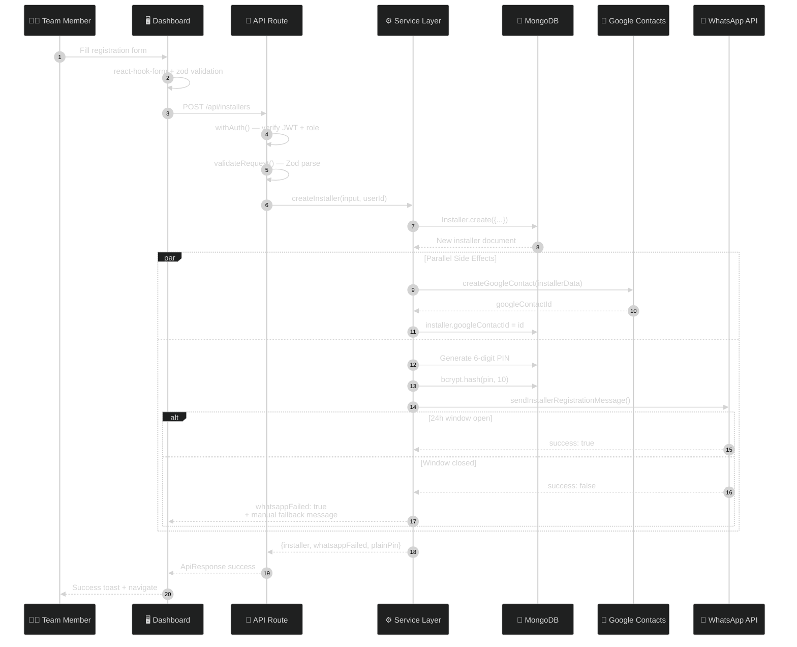

---

## Caching Strategy

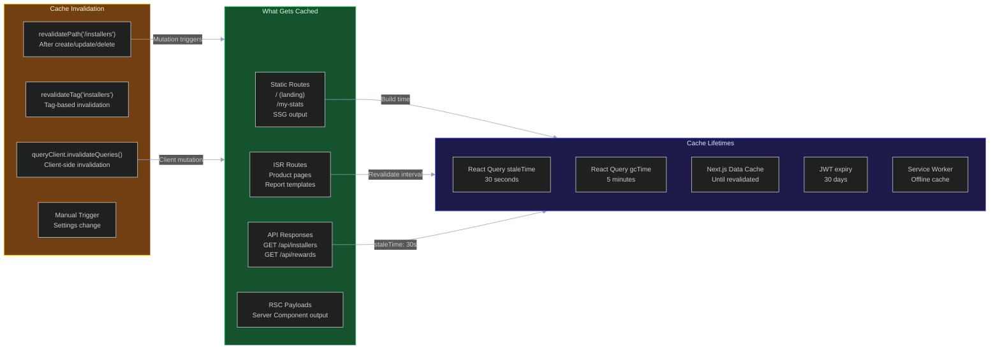

---

## Rendering Modes

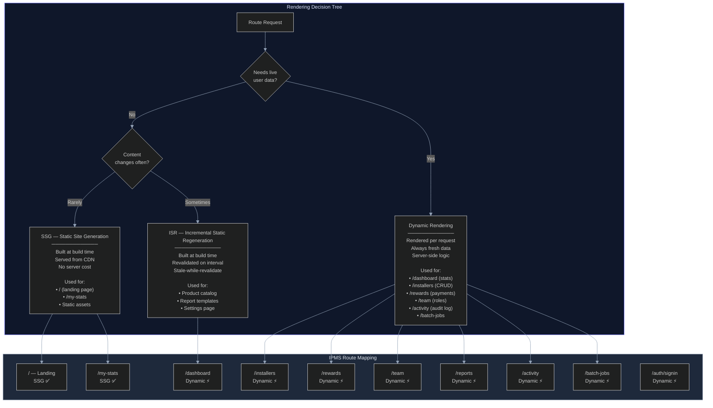

---

## Complete Data Flow

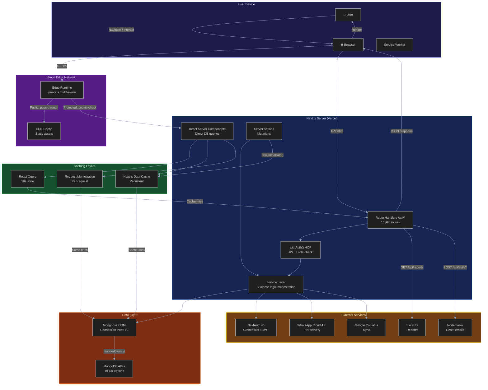

---

## Tech Stack Summary

| Layer | Technology | Version |
|---|---|---|
| Framework | Next.js (App Router) | ^16.0.8 |
| React | React + React DOM | ^19.2.1 |
| Language | TypeScript | ^5 |
| Database | MongoDB Atlas | — |
| ODM | Mongoose | ^8.18.3 |
| Auth | NextAuth v5 (Beta) | ^5.0.0-beta.30 |
| Client Cache | @tanstack/react-query | ^5.90.6 |
| Forms | react-hook-form + zod | ^7.63.0 / ^4.1.12 |
| UI | shadcn/ui + Radix UI | New York style |
| CSS | Tailwind CSS v4 | ^4.1.14 |
| Animation | Framer Motion + GSAP | ^12.23.x / ^3.13.0 |
| Testing | Vitest | ^4.1.9 |
| Deployment | Vercel | Edge + Serverless |
| CI/CD | GitHub Actions | ESLint + tsc + Vitest |
